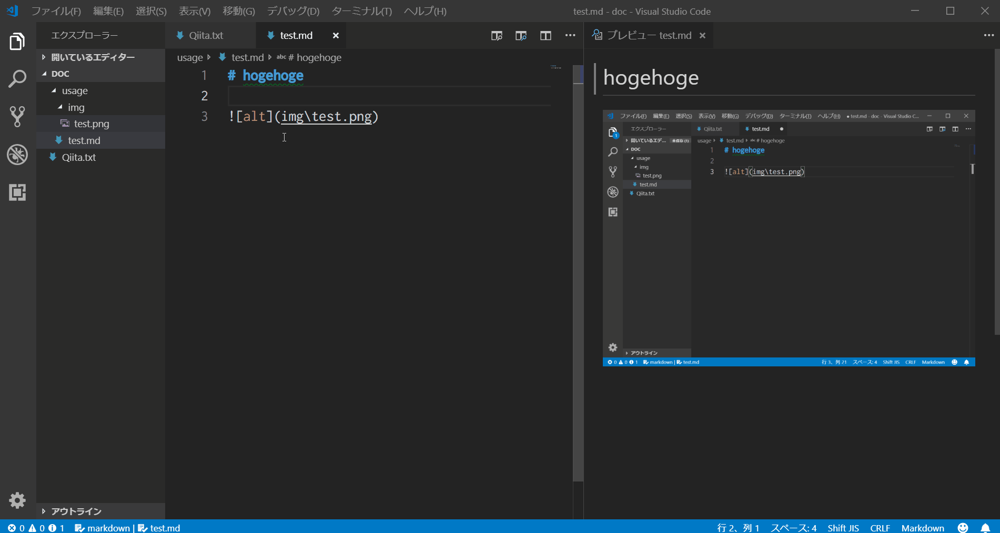

# VSCode extension - Open Image File

A plug-in for Visual Studio code that opens an image file in the path under the cursor.Available in [VisualStudio Marketplace][marketplace].

## Installation
Following method are available:

* Open [Command Palette](https://code.visualstudio.com/docs/editor/codebasics) by pressing `Ctrl + Shift + P`, type `ext install` and then look for **Open Image File** extension.
* Download vsix file for this extension from [here](https://code.visualstudio.com/docs/editor/codebasics), type `code --install-extension vscode-openimagefile-0.0.1.vsix` in command prompt.

# Usage

Following:

[marketplace]: https://marketplace.visualstudio.com/items?itemName=jsynowiec.vscode-insertdatestring